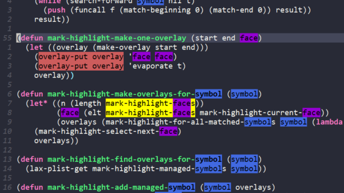

# Mark Highlight 

Mark text in buffer, with colors!

    (use-package mark-highlight
      :bind (("<f5>" . mark-highlight-toggle)
             ("S-<f5>" . mark-highlight-reset-universe)))

`mark-highlight-toggle` will search selected text in the whole file and mark/unmark them.

`mark-highlight-reset-universe` will clear everything.
